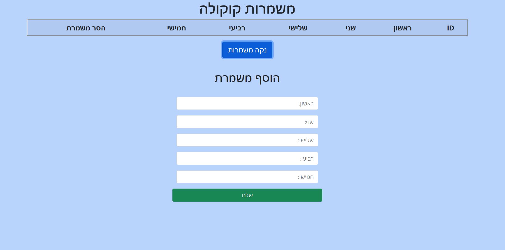
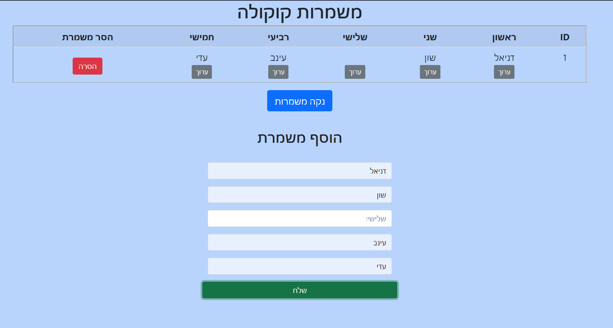
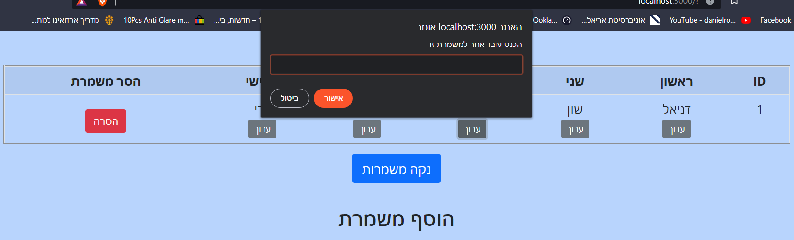
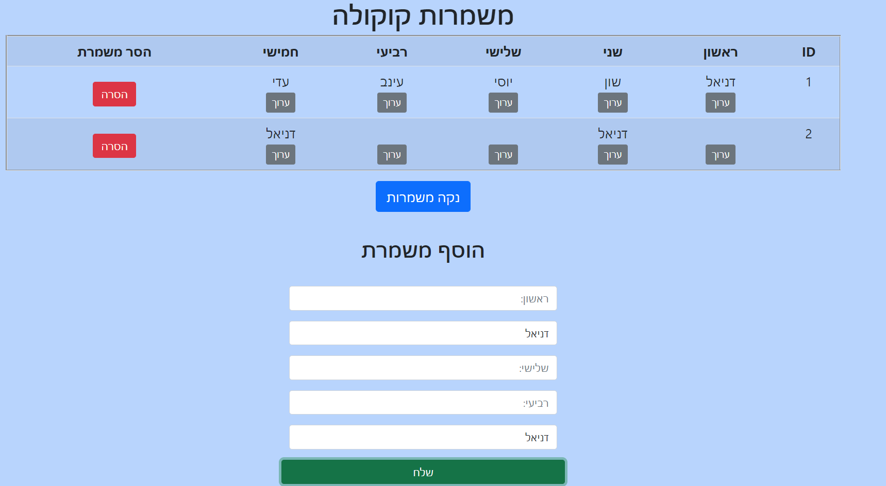

# NodeJs_Bonus_ShiftsApp
All rights reserved - Daniel Ronen

## Shifts-App is a page for bar manager to apply the shifts menegment
the data is saved on MongoDB in database: 'Shifts' in collection 'shifts'

### first page with clean table

### after adding new shift
by pressing the SEND button the document sending to the server and saved in database
and preview in the table on the page

### we can Edit the columns by pressing EDIT and put the new name

### after editing the name 'יוסי' and adding another shift

### by clicking the CLEAR SHIFTS button
we clear the collection from all documents and review a clear table

